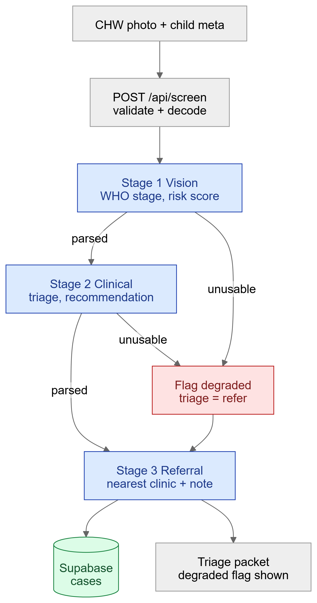
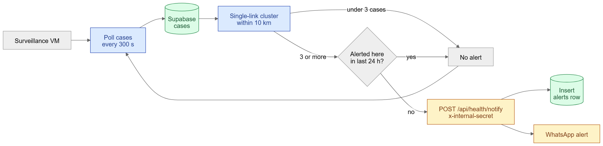

# lumos.health

AI-assisted screening for **Noma** (cancrum oris) and geographic outbreak
surveillance, built for community health workers in sub-Saharan Africa.

A health worker photographs a child's mouth. The orchestrator runs a three-stage
pipeline — visual WHO staging, clinical reasoning, and referral routing to the
nearest Noma-capable facility — and returns a triage verdict with a referral note
in the worker's language. A background agent clusters recent cases geographically
and raises an outbreak alert when a cluster crosses a threshold.

> **This is a screening aid, not a diagnosis.** Every result is generated by a
> language model and must be confirmed by a trained health professional. The
> system is built to fail towards "refer for in-person assessment", never towards
> "healthy".

---

## Repository layout

```
backend/     Express + TypeScript orchestrator (API, triage pipeline, surveillance)
frontend/    Vite multi-page app (landing + screening, case map, 3D result viewer)
docs/        Tutorials, how-tos, reference and design rationale
diagrams/    Architecture diagrams (mermaid source + editable excalidraw + rendered)
```

## Documentation

| Document | Kind |
|---|---|
| [Run your first screening](docs/tutorial-first-screening.md) | Tutorial — local setup end to end, no accounts needed |
| [How to run the tests](docs/howto-run-tests.md) | How-to — quality gates, adding a test |
| [Contributing](docs/CONTRIBUTING.md) | How-to — CI gates and codebase conventions |
| [Frontend reference](docs/reference-frontend.md) | Reference — pages, modules, exports, env vars |
| [Testing reference](docs/reference-testing.md) | Reference — what each suite covers |
| [Why the app fails towards "refer"](docs/explanation-safety-model.md) | Explanation — the safety and privacy decisions |

Component docs sit next to the code: [`backend/README.md`](backend/README.md)
and [`frontend/README.md`](frontend/README.md).

## Quick start

The fastest path needs no database, no model provider and no cloud account.

```bash
# Terminal 1 — API in mock mode
cd backend
cp .env.example .env          # MOCK_MODE=true is already the default
npm install
npm run dev

# Terminal 2 — web app
cd frontend
npm install
npm run dev                   # http://localhost:5173
```

Open the app, click **Sign in → Continue with the demo account**, and submit any
photo. In mock mode the pipeline returns a clearly-labelled demonstration result.

The demo button only appears when the server reports `mock_mode: true`, and the
`demo` token is rejected by any server that is not in mock mode.

## Running against real services

Fill in `backend/.env` (see `backend/.env.example` for every variable):

| Capability | Variables |
|---|---|
| Database | `SUPABASE_URL`, `SUPABASE_SERVICE_ROLE_KEY` |
| Model inference | `DEDALUS_API_KEY`, `DEDALUS_MODEL` |
| Phone sign-in | `FIREBASE_PROJECT_ID`, `FIREBASE_CLIENT_EMAIL`, `FIREBASE_PRIVATE_KEY` |
| Outbreak alerts | `WHATSAPP_PHONE_NUMBER_ID`, `WHATSAPP_ACCESS_TOKEN`, `WHATSAPP_ALERT_TO_NUMBER` |
| Surveillance VM | `ORCHESTRATOR_URL`, `ORCHESTRATOR_INTERNAL_SECRET` |

Then set `MOCK_MODE=false`.

Configuration is validated at boot by `backend/src/config.ts`. A missing or
malformed value fails immediately with a readable message rather than surfacing
as `undefined` deep inside a request.

### Database setup

```bash
psql "$DATABASE_URL" -f backend/supabase/migrations/001_initial_schema.sql
psql "$DATABASE_URL" -f backend/supabase/migrations/002_auth_phone.sql
psql "$DATABASE_URL" -f backend/supabase/migrations/003_token_hashing_and_roles.sql
psql "$DATABASE_URL" -f backend/supabase/seed.sql   # local development only
```

Migration 003 hashes bearer tokens and introduces an explicit `role` column;
it backfills existing rows, so it is safe to run on an existing database.

### Frontend configuration

`frontend/.env.local`, from `frontend/.env.example`. Every `VITE_*` value is
inlined into the bundle and is therefore **public** — never put a service-role
key or API secret there.

Leave `VITE_API_URL` blank to call the API same-origin, which is correct when a
reverse proxy serves `/api`. `npm run dev` proxies `/api` to `localhost:3001`.

## Architecture

### The triage pipeline

A screening request runs three stages in order. Each stage's output is
schema-validated before the next one sees it.

<p align="center">
  
</p>

**Failure behaviour.** When a stage fails, the response is **not** filled in
with plausible clinical findings. The stage returns empty, the packet is flagged
`degraded: true` with the failed stages listed, triage defaults to `refer`, and
the UI says the assessment was incomplete. Stage 2 is skipped entirely when
stage 1 fails, because reasoning over an empty assessment only invites the model
to invent findings. See `backend/src/lib/triage.ts`.

### Outbreak surveillance

A separate agent watches for geographic clustering. Constants live in
`backend/src/lib/agentScripts.ts`.

<p align="center">
  
</p>

A cluster that already alerted within 24 hours is skipped, so one outbreak does
not page the same number every five minutes. The cooldown check fails open: if
it cannot be evaluated, the alert is sent anyway, because a duplicate alert
beats an outbreak going unreported.

Diagram sources live in [`diagrams/`](diagrams/) as `.mmd` (mermaid) alongside
editable `.excalidraw` scenes and rendered `.svg`/`.png`. Edit the `.mmd` and
re-render, or open the `.excalidraw` at excalidraw.com.

## API

| Method | Path | Auth | Notes |
|---|---|---|---|
| `GET` | `/api/health` | none | Liveness and dependency status |
| `POST` | `/api/auth/firebase` | none | Firebase ID token → CHW bearer token |
| `POST` | `/api/screen` | CHW | Run the triage pipeline |
| `GET` | `/api/cases` | CHW | Paginated cases, scoped by role |
| `GET` | `/api/cases/:id` | CHW | Single case |
| `GET` | `/api/cases/map` | none | **De-identified** points for the public map |
| `GET` | `/api/alerts` | CHW | Outbreak alerts |
| `GET` | `/api/alerts/count` | none | Badge count only |
| `GET` | `/api/clinics` | CHW | Facility directory, optional proximity filter |
| `POST` | `/api/health/surveillance/start` | internal secret | Provision the surveillance VM |
| `POST` | `/api/health/notify` | internal secret | Called by the surveillance VM |

## Security and privacy

- **Tokens are stored hashed.** Only a SHA-256 digest of a bearer token is
  persisted, so a dump of the `chws` table yields no usable credentials.
- **Roles are explicit.** Access is decided by a `role` column, not by pattern
  matching on a free-text region field.
- **The public map is de-identified.** Coordinates are rounded server-side to a
  ~1.1 km grid; no patient age, reporting worker, or clinical note is exposed.
- **Internal endpoints require a shared secret.** Provisioning a VM and
  dispatching alerts are both authenticated.
- **CORS is an explicit allowlist.** Production refuses to start with `*`, since
  every route is credentialed.
- **Uploads are verified.** Base64 is validated, decoded size is capped, and file
  signatures are checked — a client-supplied MIME type is never trusted.
- **Model output is schema-validated** before it reaches the database or a
  clinician's screen.
- **Logs are redacted.** Images, tokens, phone numbers, coordinates and clinical
  notes are stripped before anything is written.

The service-role Supabase key bypasses row-level security, so all access control
is enforced in application code — see `backend/src/routes/cases.ts`.

The reasoning behind each of these is in
[Why the app fails towards "refer"](docs/explanation-safety-model.md).

## Development

```bash
# backend
npm run dev         # watch mode
npm run typecheck
npm run lint
npm test            # vitest
npm run build && npm start
npm run cleanup:vms -- --yes    # destroy orphaned billable VMs

# frontend
npm run dev
npm run build
npm run preview
npm run lint
```

### Tests

58 tests across 5 suites, run with Vitest. They run offline in mock mode: no
database, no model provider, no VMs.

```bash
cd backend && npm test
```

| Suite | Tests | Covers |
|---|---|---|
| `tests/api.test.ts` | 16 | Routes end to end via supertest, including auth regressions |
| `tests/validation.test.ts` | 17 | Image decoding, file signatures, size limits |
| `tests/auth.test.ts` | 10 | Token generation, hashing, constant-time comparison |
| `tests/geo.test.ts` | 9 | Haversine distance, coordinate coarsening, triage bands |
| `tests/case-scope.test.ts` | 6 | Who may read which cases |

The frontend has no unit tests; CI covers it with ESLint and a production build.
Full detail, including what is deliberately **not** covered, is in the
[testing reference](docs/reference-testing.md). Commands and how to add a test:
[how to run the tests](docs/howto-run-tests.md).

### Continuous integration

`.github/workflows/ci.yml` runs on every pull request and on pushes to `main`.
The backend job runs lint, typecheck, test and build, then boots the built
server and polls `/api/health` — because a successful `npm run build` is not the
same as a working `npm start`. The frontend job runs lint and build.

## Deployment

The backend targets a long-lived Node process (Node 20+). `backend/api/index.ts`
also exports the app for Vercel; two caveats apply on serverless:

- Rate limits use an in-memory store and are therefore per-instance. Use a shared
  store (Redis) if you depend on them.
- The surveillance agent needs a persistent process. Call
  `POST /api/health/surveillance/start` once after deploying, with the
  `x-internal-secret` header.

The frontend is a static build (`npm run build` → `frontend/dist`). Serve it
behind a proxy that forwards `/api` to the orchestrator, or set `VITE_API_URL`
and add the frontend's origin to the backend's `CORS_ORIGINS`.

## Cost note

The surveillance agent provisions a VM that bills by the hour, and it is only
started when `ORCHESTRATOR_URL` is set. If a process is killed without a clean
shutdown, run `npm run cleanup:vms -- --yes` to destroy anything orphaned.

## Data sources

Historical case counts on the map are aggregate totals from published literature
for each site over a study period — they are not individual patient locations,
and the map renders them as single proportional circles to avoid implying
otherwise. Incidence figures for noma are poorly measured and vary between
sources.
